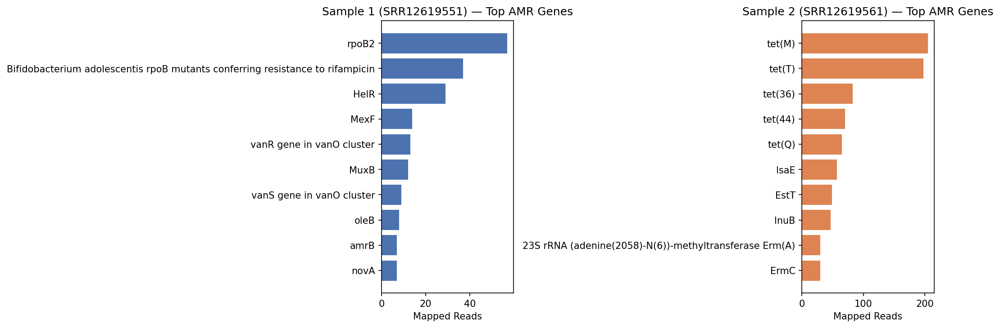
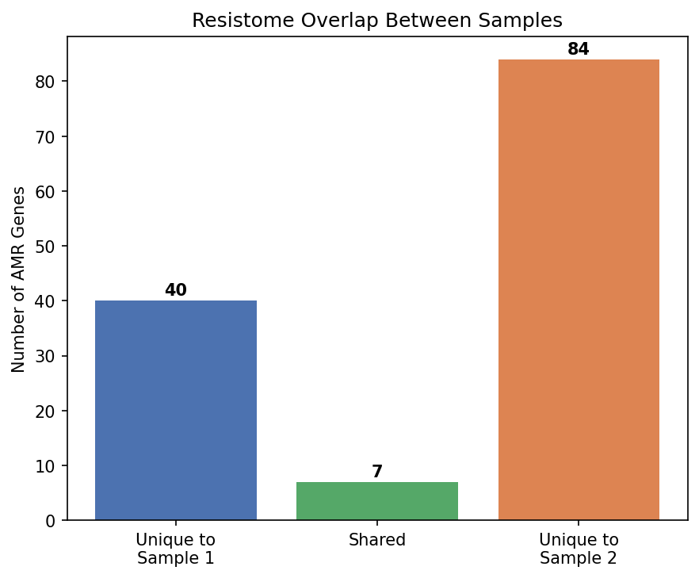
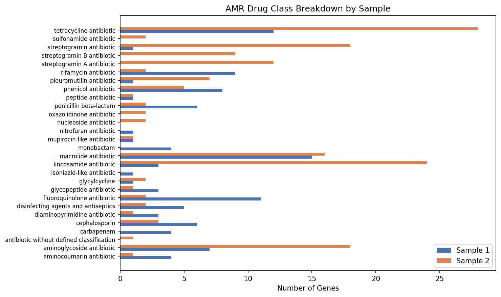

# Manure Resistome Profiling: A Real Raw-Reads AMR Detection Pipeline

A raw-reads-to-results pipeline that detects and compares antimicrobial resistance (AMR)
genes in real shotgun metagenomic sequencing data from livestock manure, using the
Comprehensive Antibiotic Resistance Database (CARD) and the Resistance Gene Identifier (RGI).

Manure is a recognized environmental reservoir for AMR genes, and understanding what resistance
genes are actually present and how they differ between sources  is directly relevant to
composting and manure management practices intended to reduce resistance gene spread before
land application.

## What this demonstrates

- A complete raw-reads bioinformatics workflow: public SRA data retrieval, quality control,
  and reference-based AMR gene detection — not just downstream analysis of a pre-built table
- Use of RGI (bwt mode) against the CARD database, the standard academic tool/database
  pairing for antimicrobial resistance gene detection
- Direct comparison of resistomes between two real manure metagenome samples, at both the
  individual gene and drug-class level
- Honest reporting of a low read-mapping rate (AMR genes are a small fraction of any
  metagenome) without overstating what a small, subsampled dataset can support

## Data

Real paired-end Illumina shotgun metagenomic reads from NCBI BioProject PRJNA662623
(https://www.ncbi.nlm.nih.gov/bioproject/PRJNA662623), a study on swine and cattle manure
resistomes. Two samples (SRR12619551, SRR12619561), each subsampled to 500,000 read pairs
for tractable processing.

Note on scope: each sample was subsampled from its full sequencing depth, and results are
based on 2 samples — enough to demonstrate the pipeline and detect a real, interpretable
signal, but not a statistically powered comparison across manure types. This is a descriptive
and comparative resistome profiling project, not a predictive model.

## Project structure

manure-resistome-pipeline/
├── data/
│   ├── SRR12619551_gene_results.csv
│   └── SRR12619561_gene_results.csv
├── figures/
│   ├── top_genes_comparison.png
│   ├── gene_overlap.png
│   └── drug_class_breakdown.png
├── RESULTS.md
└── README.md

## Method summary

1. Data retrieval — sequencing runs identified via NCBI Entrez Direct from BioProject
   PRJNA662623; reads pulled directly via fastq-dump (500,000 read pairs per sample).
2. Quality control — adapter trimming and quality filtering with fastp.
3. AMR gene detection — trimmed reads aligned directly to the CARD reference database
   using RGI's bwt mode (Bowtie2 aligner), which maps reads to known resistance gene
   sequences without requiring assembly.
4. Comparison — gene-level and drug-class-level resistomes compared between the two
   samples: which genes are shared vs. sample-specific, and how drug-class composition differs.

## Results at a glance

| Top genes per sample | Resistome overlap | Drug class breakdown |
|---|---|---|
|  |  |  |

- Sample 1 detected 47 AMR genes, dominated by rifamycin resistance and RND-family efflux
  pumps (MexF, MuxB/C, amrB) — mechanisms common in soil-associated environmental bacteria.
- Sample 2 detected 91 AMR genes, dominated by tetracycline resistance (tet(M), tet(T),
  tet(36), tet(44), tet(Q)) and lincosamide/macrolide resistance — a pattern consistent with
  antibiotic-driven selection.
- Only 7 of 124 total unique genes detected were shared between the two samples, indicating
  the resistome composition is largely sample-specific rather than a common "core" set.

Full gene-level tables and interpretation are in RESULTS.md.

## Running it

Requires RGI and the CARD database (installed via conda/bioconda; see notebook for full
environment setup, including Colab-specific workarounds for --local database mode).

    fastq-dump -X 500000 --split-files --gzip <SRR_accession>
    fastp -i <sample>_1.fastq.gz -I <sample>_2.fastq.gz -o <sample>_1.trim.fastq.gz -O <sample>_2.trim.fastq.gz
    rgi bwt --read_one <sample>_1.trim.fastq.gz --read_two <sample>_2.trim.fastq.gz --aligner bowtie2 --output_file <sample>_rgi_bwt --local --clean

## Adapting this to other samples or a full dataset

- Swap in any SRA accession under a BioProject of interest — the pipeline is accession-agnostic.
- To scale to a full comparative study, this would extend naturally to more samples per group
  (e.g. treated vs. untreated compost, or multiple animal sources) enabling statistical
  comparison and, with enough samples, a genuine classification model predicting sample
  origin/treatment from resistome fingerprint.
