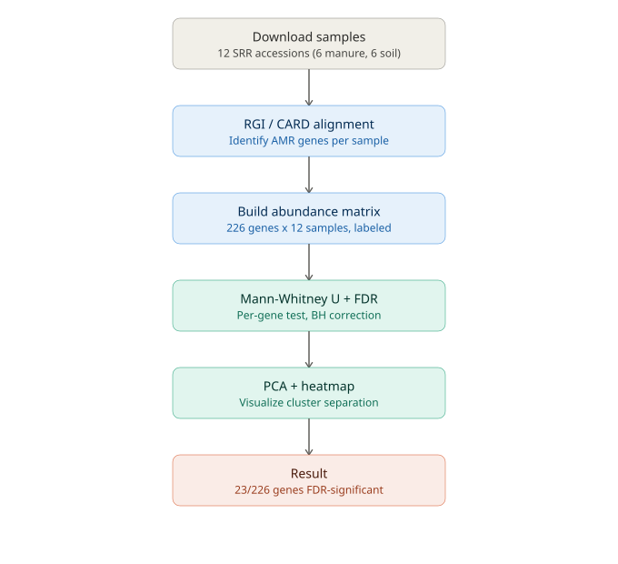

# AMR Resistome Comparison: Manure vs. Soil

A statistical comparison of antimicrobial resistance (AMR) gene profiles between
manure-associated and soil-associated metagenomic samples, using public
sequencing data and a Mann-Whitney U + FDR-corrected testing pipeline.

## Background

This project started as a 2-sample (1 manure vs. 1 soil) descriptive comparison
of AMR gene presence/absence. That version could describe differences between
two specific samples but couldn't support any general claim about manure vs.
soil resistomes  with n=1 per group, an observed difference could just as
easily reflect individual sample variation as a real biological pattern.

This version extends that same comparison to 12 samples (6 manure, 6 soil),
adding proper statistical testing 

> The original 2-sample pilot analysis is preserved separately in [amr-resistome-pilot](https://github.com/Joshbfaaaa/amr-resistome-pilot).

## Pipeline



1. **Download samples** — pull 12 SRR accessions from SRA (6 manure, 6 soil,
   balanced by isolation source)
2. **RGI / CARD alignment** — identify AMR gene presence/abundance per sample
   against the CARD database
3. **Build abundance matrix** — merge per-sample results into a single
   gene x sample matrix, labeled by source
4. **Mann-Whitney U + FDR** — test each gene for a significant difference
   between manure and soil groups, then apply Benjamini-Hochberg correction
   across all genes tested
5. **PCA + heatmap** — visualize how samples cluster and which genes drive
   the separation

## Results

- **226** AMR genes detected across all 12 samples
- **55** genes significant at raw p < 0.05
- **23** genes (10.2%) remain significant after FDR correction the number
  that actually matters, since testing 226 genes means several would clear
  p < 0.05 by chance alone
- **19 manure-enriched, 4 soil-enriched** among the 23 FDR-significant genes

### Key finding

Manure-enriched genes cluster almost entirely in antibiotic classes
associated with livestock use: tetracycline (6 genes, including `tet(M)` at a
mean of 147.5 reads in manure vs. 0 in soil), macrolide, lincosamide,
aminoglycoside, and sulfonamide resistance. Soil-enriched genes (`rphA`,
`HelR`, `vanR` in the vanO cluster, `ceoB`) instead reflect resistance
mechanisms more typical of intrinsic/environmental bacteria — rifamycin,
glycopeptide, and efflux-based resistance rather than agricultural
exposure.

See `results/gene_mannwhitney_significant_only.csv` for the full list of
23 significant genes, and `figures/pca_manure_vs_soil.png` /
`figures/heatmap_top_genes.png` for the visualizations.

## Repo structure

```
.
├── data/
│   ├── accessions.txt
│   └── sample_metadata.csv
├── scripts/
│   ├── 02_run_rgi.sh
│   ├── 03_merge_rgi_results.py
│   ├── 04_analyze_resistome_stats.py
│   └── 05_list_significant_genes.py
├── results/
│   ├── amr_abundance_matrix.csv
│   ├── gene_mannwhitney_results.csv
│   └── gene_mannwhitney_significant_only.csv
├── figures/
│   ├── pipeline_flowchart.svg
│   ├── pca_manure_vs_soil.png
│   └── heatmap_top_genes.png
└── README.md
```

## Methods notes

- Statistical testing: Mann-Whitney U (two-sided), per gene, followed by
  Benjamini-Hochberg FDR correction across all 226 genes tested.
- Only the FDR-adjusted p-value is treated as evidence of a real difference;
  raw p-values are reported for transparency but not used to draw conclusions.
- n=6 per group is a small sample size for a resistome study this is a
  proof-of-concept analysis, not a definitive characterization of manure vs.
  soil resistomes generally.

## Running the pipeline

```bash
chmod +x scripts/*.sh
./scripts/02_run_rgi.sh data/accessions.txt   # downloads, trims, and runs RGI per sample (skips steps already done)
python scripts/03_merge_rgi_results.py
python scripts/04_analyze_resistome_stats.py
python scripts/05_list_significant_genes.py
```
